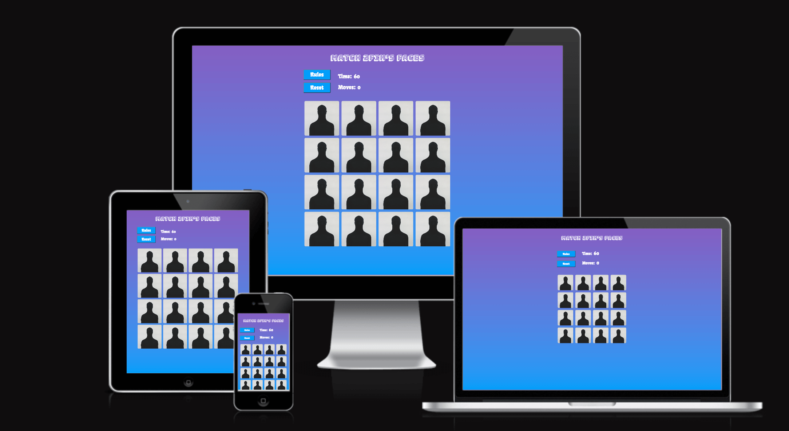

# Match 2fik's Faces

## Project Portfolio 2 - Full Stack Development 
##  Design an interactive Front-End web application using HTML and CSS and JavaScript 

## Site Info

* Match 2fik's Faces is created for all users who like to play simple memory games. The  user who knows 2Fik’s  art work might have an additional interest as well. 
* This is my Project Portfolio 2 submission for Code Institute's Diploma in Web Application Development course. Technologies used include HTML, CSS, JavaScript.
  - [Live here](https://bakrydiarra.github.io/Project-2-Portfolio-Memory-Game/)
 

## Index – Table of Contents
* [User Experience (UX)](#user-experience-ux)
* [Features](#features)
* [Testing](#testing)
* [Deployment](#deployment)
* [Credits](#credits)

## User Experience (UXD)

-   ### User stories

 - As a user I  can:

   - see a set of cards ranged in fourth rows and fourth columns of cards - these cards have a front and back image.
   - read  easy and short explained rules by clicking the button rules
   -  escape the rule explanation by clicking the “x” or the the button play.
   - click a card to start the game
   - click only on two cards at a time, to try to find a matched pair.
   - play on a limited time - 60 seconds - to find all matched pair.
   - expect that once the game has been completed, the timer will stop.
   - receive a message of  victory and score at the end of the game when all matched pairs have been found.
   - receive a message to be informed that he has lost when the timer arrived at 0.
   -  close the pop up  victory or defeat messages by clicking  on the "x" button or  clicking the button try again.
   - Reset the game at any time during play.
   - can test his memory skills and enjoy the challenge to beat the timer.

## Strategy
   - The game is a single page site with several modals that act as popup windows.It might intrigues the user because all pictures are different characters personified by one person, the artist 2Fik. The timer of 60 seconds push the excitement of the user to find all pair matched or to beat a score if he has already playded.  

## Scope
  -  a set of 16 cards with back and front sides.
  - Rule explanation
  - Timer
  - Moves counter
  - Game result
  - Reset button

## Structure

 - The style of the website is based 4 rows on 4 columns of cards. Above this display two buttons on their side indicator of time and moves on the top a title.
 - The design should be simple and let the user to play without any distractions. It is designed as a playfull interactive memory game where the user can replay as many times as they wish.

 ## Skeleton
  - All Wireframes were designed for laptop/computer, iPad/tablet and phone display.

  [Mockup desktop](assets/readme/wireframe_desktop.png)

  [Mockup desktop modal window](assets/readme/wireframe_desktop_modal_window.png)

  [Mockup small devices ](assets/readme/wireframe_smallDevices.png)

  [Mockup small devices pop-up window](assets/readme/wireframe_smallDevices_lost.png)

  [Mockup small devices pop-up window](assets/readme/wireframe_smallDevices_rules.png)

  [Mockup small devices pop-up window](assets/readme/wireframe_smallDevices_won.png)
  

 ## Surface
 - The colour scheme was chosen to be soft and harmonious. It has been chosen with the help of (https://mycolor.space/). White was used for the font-family to give a contrast for the reading experience.
 [Colour Scheme](assets/readme/Pasted_Graphic.png)

## Typography
 - The chosen font-families are Bungee Shade and Fruktur, fun and distinguishing style to convey a playfull atmosphere.
   

## Issues Faced during development

    - Timer: As I made my first function to set the timer, it didn't stop at 0, it went with negative number. I had to reajust the if statement timer < = 0 to timer < 1 and move the clearInterval(interval) in the gameOver. I had to include clearInterval(interval) in the rest function before the setTimeout to make sure that the timer would be reset properly.
    - Button Rest and Rules had to be repositioned many time so that the layout keeps in the game-info-container everything properly. I had to make many tryouts to find the proper dimension for the @ media queries, in order to deliver a responsive display for smaller devices.
    

  
    

 
## Features

### Existing Features

#### Grid Display

 - Simple layout, using a 4x4 style grid, with a total of 16 cards. The background is linear gradient, using some colors of my chosen color scheme.
 - [Display Grid](assets/readme/desktop.png)

#### Picture

 - The pictures were provided by the artist 2Fik. They represent 2Fik embodying 8 different characters, which make it playfull to discover all characters ans can be challenging to match pair because they all have something in commun. The backface picture is just anonymous figure of 2Fik.

- [Picture Back Face](assets/images/Portrait-2Fik-Web.webp)
- [Picture Front Face](assets/images/Portrait-Alice-Web.webp)

#### Navigation buttons

 - All buttons permit - except rules button - to reset the game- We have 3 styling. 

 - [Pictures Button](assets/readme/button1.png)
 - [Pictures Button](assets/readme/button2.png)
 - [Pictures Button](assets/readme/button3.png)
 
 #### Rules Modal
 - A pop-up window explains briefly and straight to the point the rules of the game.
 - [Rules Modal Window](assets/readme/desktop_rules.png)

 #### Won Modal 
  - A pop-up window informs the user about his victory, giving his score with timing and count of moves. The styling is similar to the Rules pop-up window and pop-up lost widow.
  - [Won Modal Window](assets/readme/desktop_won.png)

#### Lost Modal
 - A pop-up window informs the user about his defeat. The styling is similar to the Rules pop-up window and pop-up lost widow.
  - [Lost Modal Window](assets/readme/desktop_lost.png)

#### Game Information

 - A timer is activated once the user flips the first card.
 - A  moves tracker counts each match attempt made, the counter starts the count when the second card had been flipped.
 - [Indicators](assets/readme/indicators.png)

### Features which could be implemented in the future

 - A modal window  leader players- where saving game results-  which could inform the score from previous users would encourage in a friendly competitive way to participate to the game.
 - Level function where the player could change the timer countdown and eventually add or take away some cards
 - Animation when the user hoovers over the cards
 - A clicking sound when the user click on a cards
 - A music that could start at the moment a card is flipped - with a mute button option
 - Animation in the won modal window to cheer up more the user to play again

## Testing

### Validator Testing

 - HTML : No errors were detected : [HTML-Validator](assets/readme/HTML_validator.png)

 

 - CSS : No erros were detected :  [CSS-Validator](assets/readme/CSS_Validator.png)

 - JavaScript : NO errors were detected : [JS](assets/readme/js.png)

### Lighthouse Testing
 
 - The performance is to be improved. During running Lighthouse, the first time the performance was 83. There was a suggestion to change picture  format from png to webp. But it hasn't made a real difference.  
 -  [Lighthouse for desktop](assets/readme/Lighthouse_desktop.png)
 -  [Lighthouse for mobile](assets/readme/Lighthouse_phone.png)

### Browser Compatibility

  - Testing has been carried out on the following browsers :
  - Safari on macOS Ventura (Safari  Version 13.0.1)
  - Chrome Version Version  Version 108.0.5359.124 

### Test Cases and Results

 - Chrome Developer tools and Mozilla Firefox Web Developer Tools were used throughout the development of the site to test functionality, responsive 
    behaviour, alignment correctness etc:
     - BakckBerry z30
     - BlackBerry PlayBook
     - iPhone SE
     - iPhone XR
     - iPad Air
     - Surface Duo
     - Nest Hub
     - Nest Hub Max

#### Responsive Design

 - The display of the game has been made responsive to allow it to maintain the same grid structure layout in either desktop, tablet, without changing the look of the game.

 - [Responsive Sample](assets/readme/responsive_iPhone.png)
 - [Responsive Sample](assets/readme/landscape_Responsive.png)

 - To check the respponsive design, I also used [Responsinator](http://www.responsinator.com/) 
 - Site responsivness visualised using [Am I Responsive?](https://ui.dev/amiresponsive)
 - Manual testing on different browsers and devices such as iPhone 8, Samsung Galaxy and received feedbacks from friends regarding other various devices.

| Feature | Expect | Action | Result |
| :--- | :--- | :--- | :--- |
| Active Homepage | 4x4 grid style game, title, two buttons | clicked live link| positive | 
| Start Game| By clicking a card | clicked a card | postive |
| Timer| to count from 60 to 0 when the first is clicked | clicked a the first card and saw the timer coutning down | positive |
| Flipping Card | Clicking the back face of a card and switch to the front face | clicked the card | positive |
| Click only on two cards at a time | not able to click a third card | clicked a third card = no flipp | positive |
| Match two cards and lock them| clicking and finding two similar cards | clicked two identical cards and they stay put | positive|
| No Match Unflipcard | Clicking two cards one after another if no match they front face unflipp to the back face | clicked two cards, no match, they retrun on their back face | positive|
| Moves tracker| By clicking every second card form en eventual pair, it counts one move | clicked two cards. It added a moves  | positive |  
| Button Rules | Pop-up window to inform the user about the game rules | clicked and accessed to the rules | positive |
| Button- Play, Try Again, Reset and "x"| By clicking to reset the game and play | clicked and could reset everytime and start a new game | positive |
| Pop-up Window Rules| | | |
| Pop-up Window Won | | | |
| Pop-up Window Lost | | | |

## Deployment

- The site was deployed to GitHub pages. The steps to deploy are as follows:
 - In the Github repository, navigate to the Settings tab
 - From the source section drop-down menu, select the main branch
 - Once the master branch has been selected, the page will be automatically refreshed with a detailed ribbon display to indicate the successful deployment
 - The live link can be found here: (https://bakrydiarra.github.io/Project-2-Portfolio-Memory-Game/)

 
## Credits 

### Technologie used

### Languages Used 

 - HTML- To create a basic site.
 - CSS- To create the look for the game.
 - JavaScript- For the logic of the game. To manipulate the HTML and CSS on the screen.

### Progremmes Used

 - [Google Fonts](https://fonts.google.com/knowledge) - to import font-family.
 - [Balsamiq](https://balsamiq.com/) - for creating a mockup.
 - [mycolor](https://mycolor.space/) - for creating harmonious colors.

### Tools and Other Resources Used:

 - [Github](https://github.com/) -  for version control and pushing content to repository.  
 - [Gitpod](https://www.gitpod.io/)  -  for building the site.  
 - [W3 Schools](https://www.w3schools.com/) - for HTML, CSS, JS tips. 
 - [Am I Responsive?](https://ui.dev/amiresponsive) - test responsive website
 - [Responsinator](http://www.responsinator.com/) - test responsive website
 

### Code Used
  
 - [Gitpod Full Template](https://github.com/Code-Institute-Org/gitpod-full-template) -  used as a template for the gitpod environment.
 - [W3 Schools](https://www.w3schools.com/howto/howto_css_flip_image.asp) - used and adapted for the structure of the memory-card and flip effect 3d.
 - [Love Maths Challenge](https://www.youtube.com/watch?v=C3O-G2ab46Q&list=PLM37jTHCwXy5X9KQA5MqJU7XJttB2rEPc&index=106) - used for function DomContenLoaded function and adapted.
 - [Build a Fun Memory Card Game with JavaScript](https://www.youtube.com/watch?v=HsD6f7_3nIg&list=PLngoRLGHq3kCpoT0urRHDPsNVTM7aYsiv&index=3) - used onclick function for cards, add flip class for css effects.
 - [Build a Fun Memory Card Game with JavaScript](https://www.youtube.com/watch?v=CtFOeJneBaA&list=PLngoRLGHq3kCpoT0urRHDPsNVTM7aYsiv) - used checking if CardOne & CardTwo 'data-id' are a match.
 - [Build a Fun Memory Card Game with JavaScript](https://www.youtube.com/watch?v=1G6MwIy-7Yc&list=PLngoRLGHq3kCpoT0urRHDPsNVTM7aYsiv&index=8) - used for shuffle function and adapted without IIFE.

### Media 

 
 - [Google Fonts](https://fonts.google.com/) - for the fomt-families
 - The photos were taken from 2Fik's website with his consent [2Fik](https://2fikornot2fik.com/fr/identities/)
 - Photograher:
   - 2fik
   

### Content
 
 - All texts were written by me.

## Acknowledgments

 - Many thanks to my Mentor Antonio Rodriguez for helpful feedback, industry insights and recommended tools.
 - Many thanks to my friends (Marjorie and Louise) and family for helping me testing the website and for their precious feedbacks.